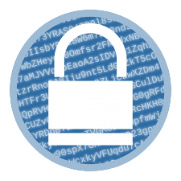

# 🔐 Criptógrafo

[](https://leoachaves.github.io/cifraDeCesar/)
[](https://developer.mozilla.org/en-US/docs/Web/HTML)
[](https://developer.mozilla.org/en-US/docs/Web/CSS)
[](https://developer.mozilla.org/en-US/docs/Web/JavaScript)



Uma ferramenta web interativa para **codificar e decodificar mensagens** utilizando dois métodos criptográficos clássicos: **Cifra de César** e **Base64**.

---

## 🚀 Demo ao Vivo

**Acesse a aplicação em produção:** [https://leoachaves.github.io/cifraDeCesar/](https://leoachaves.github.io/cifraDeCesar/)

---

## 🎯 Objetivo

Este projeto foi desenvolvido como ferramenta educacional para demonstrar o funcionamento de dois métodos de criptografia:

| Método             | Descrição                                                                                        |
| ------------------ | ------------------------------------------------------------------------------------------------ |
| **Cifra de César** | Criptografia por substituição onde cada letra é deslocada um número fixo de posições no alfabeto |
| **Base64**         | Esquema de codificação que representa dados binários em formato de texto ASCII                   |

---

## ✨ Funcionalidades

- ✍️ **Entrada de texto** para mensagens (até 55 colunas × 7 linhas)
- 🔄 **Seleção do método** (Cifra de César ou Base64)
- 🎚️ **Chave ajustável** (1 a 99) para a Cifra de César
- 🔀 **Alternância entre Codificar e Decodificar**
- 📤 **Exibição do resultado** na própria página
- 🎨 **Design responsivo** com tema "retrô/cyberpunk"
- ⚠️ **Validação de entrada** (Base64 rejeita caracteres inválidos)

---

## 🛠️ Tecnologias Utilizadas

| Tecnologia            | Descrição                                                        |
| --------------------- | ---------------------------------------------------------------- |
| **HTML5**             | Estrutura da página                                              |
| **CSS3**              | Estilização e responsividade (dois arquivos: principal e mobile) |
| **JavaScript (ES6+)** | Lógica de criptografia e manipulação do DOM                      |
| **GitHub Pages**      | Hospedagem gratuita                                              |

---

## 📁 Estrutura do Projeto

```
cifraDeCesar/
├── index.html                 # Página principal
├── criptografia.css           # Estilos principais
├── mobile.css                 # Estilos responsivos
├── imagens/
│   └── icon3-removebg-preview.png  # Ícone/favicon
└── javaScript/
    ├── criptografia.js        # Lógica principal (eventos, UI)
    ├── cifraDeCesar.js        # Algoritmos da Cifra de César
    └── base64.js              # Algoritmos de Base64 (btoa/atob)
```

---

## 💻 Como Usar

### Acessar online

Acesse: [https://leoachaves.github.io/cifraDeCesar/](https://leoachaves.github.io/cifraDeCesar/)

### Executar localmente

1. **Clone o repositório:**

```bash
git clone https://github.com/LeoAChaves/cifraDeCesar.git
cd cifraDeCesar
```

2. **Abra o arquivo `index.html` no navegador**

---

## 🎮 Guia de Uso

### Passo a passo

1. **Digite sua mensagem** no campo de texto
2. **Escolha o método**:
   - `Cifra de César` → permite ajustar a chave (1-99)
   - `Base64` → codificação padrão
3. **Selecione a operação**:
   - `Codificar` → transforma mensagem em código
   - `Decodificar` → transforma código em mensagem
4. **Clique no botão** para executar
5. **O resultado aparece abaixo** do botão

### Exemplos práticos

| Operação             | Entrada            | Chave | Saída              |
| -------------------- | ------------------ | ----- | ------------------ |
| Codificar (César)    | `HELLO`            | 3     | `KHOOR`            |
| Decodificar (César)  | `KHOOR`            | 3     | `HELLO`            |
| Codificar (Base64)   | `Hello World!`     | -     | `SGVsbG8gV29ybGQh` |
| Decodificar (Base64) | `SGVsbG8gV29ybGQh` | -     | `Hello World!`     |

---

## 🔧 Personalização

### Alterar o tema/cores

Edite o arquivo `criptografia.css`:

```css
/* Cores principais */
body {
  background: linear-gradient(45deg, #0a0a2a, #1a1a4a);
}

button.enviar {
  background-color: #7a2be0;
  box-shadow: 0 0 10px #7a2be0;
}
```

### Modificar o intervalo da chave

No `index.html`:

```html
<input id="chave" type="range" value="21" min="1" max="99" />
```

Altere `min` e `max` conforme necessário.

---

## 🧪 Algoritmos Implementados

### Cifra de César

```javascript
// Codificar: (charCode + chave - 65) % 26 + 65
// Decodificar: (charCode - chave - 90) % 26 + 90
```

### Base64

```javascript
// Codificar: btoa(mensagem)
// Decodificar: atob(codigo) + validação de caracteres
```

---

## 🐛 Tratamento de Erros

| Situação                         | Comportamento                                  |
| -------------------------------- | ---------------------------------------------- |
| Nenhum método selecionado        | Campo "Método" fica vermelho por 1 segundo     |
| Base64 inválido para decodificar | Campo "Tipo" fica vermelho, operação cancelada |
| Entrada vazia                    | Mensagem vazia → saída vazia                   |

---

## 🌱 Desenvolvido por

**Leonardo de Almeida Chaves ✈️**

[](https://www.linkedin.com/in/leonardo-chaves-b6544b229/)
[](https://github.com/LeoAChaves)

---

## 📝 Licença

Este projeto está sob a licença MIT.

---

## 🙏 Agradecimentos

- **Júlio César** - Pela inspiração histórica da cifra
- **Resilia Educação** - Pelo projeto didático

---

<div align="center">
  <strong>
    <a href="https://leoachaves.github.io/cifraDeCesar/">🔐 Acessar Criptógrafo</a>
  </strong>
  <br>
  <br>
  
  <br>
  <em>"A segurança não é um produto, é um processo." - Bruce Schneier</em>
  <br>
  Desenvolvido com 💻 e 🔐
</div>

---
